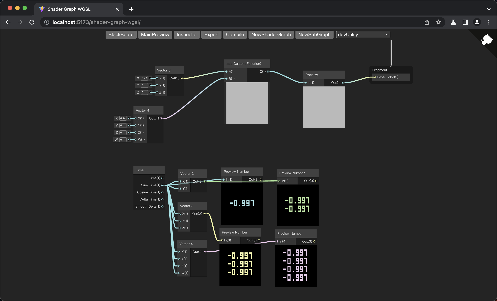
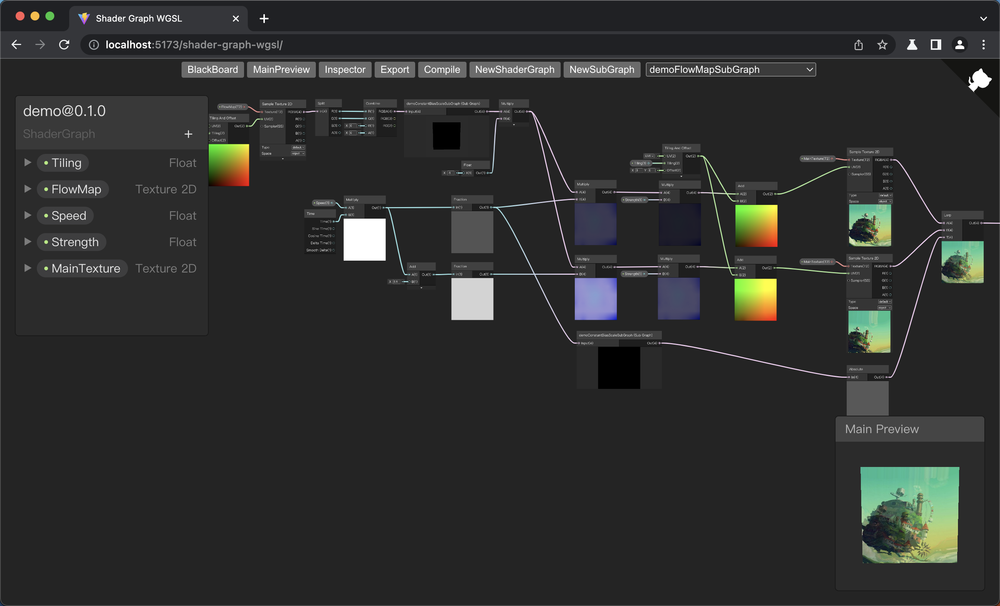

# Shader Graph WGSL

一个 Unity `Shader Graph` 高仿 `WGSL` 特供版

## Demo

[在线体验](https://deepkolos.github.io/shader-graph-wgsl/)

  
  
  
   
   
   

## TODO

- 增加 视频内 Demo https://www.bilibili.com/video/BV1GB4y1y7FT
- 增加 PreviewNumber 节点 ✅
- 增加 FlowMap Demo ✅
- 修复内存泄漏 ✅
- 完善 Lit template
- 编辑操作
  - 缩放限制
  - minimap
  - 全貌
  - 自动对齐
  - 多选

# License

MIT 仅供学习交流使用